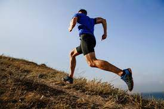
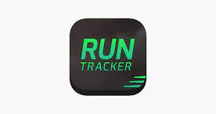
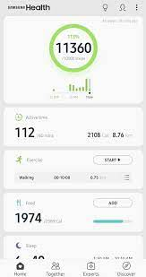
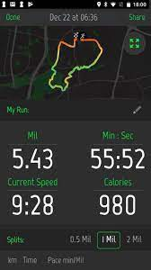

 
 
 <h1> Running </h1>
 
 El objetivo de este trabajo es analizar la información de los momentos en los que salgo a correr, La información se utilizará tanto para fines académicos como para poder conocer mis estándares al momento de practicar este deporte.

Para ello se buscará analizar:

* Velocidad promedio 
* Velocidad máxima
* Horas totales 
* Variación según estación del año y momentos del dia
* Calorías 

Como resultado se podrá comparar mi rendimiento entre el año 2020 y el 2021 y obtener conclusiones de la evolución del mismo.

La recolección de datos se realiza mediante dos aplicaciones: 

  |   
-------------|-------------
   **Samsung Health**|**Run Tracker**
|

  # [Visualizaciones](https://public.tableau.com/app/profile/francisco8740/viz/Running2020-21_16305244690990/MinutosxMesxEstacion)
 
                       

